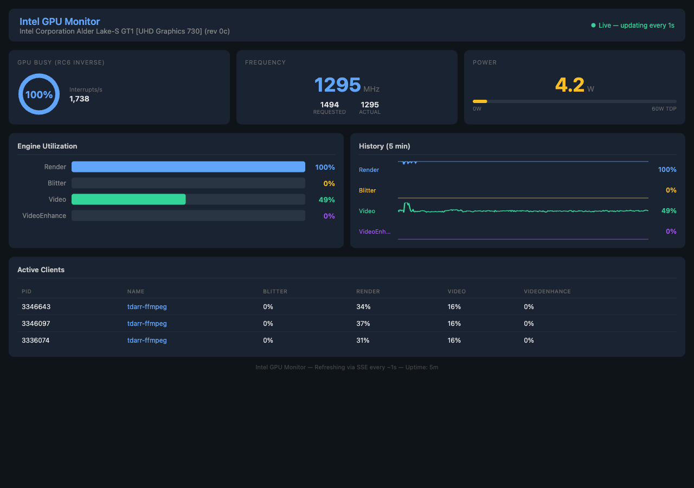

# Toparr

Real-time Intel GPU monitoring dashboard in Docker. Wraps `intel_gpu_top` (from [igt-gpu-tools](https://gitlab.freedesktop.org/drm/igt-gpu-tools) v2.3) in a web UI with live-updating gauges, sparkline history, and per-process GPU client tracking.



## Features

- **Live GPU metrics** — utilization, frequency, power draw, interrupts, and RC6 residency
- **Engine utilization** — per-engine bars (Render/3D, Blitter, Video, VideoEnhance) with 5-minute sparkline history
- **Per-process client tracking** — see which processes (Plex, Tdarr, Jellyfin, etc.) are using the GPU and how much of each engine they consume
- **SSE streaming** — updates push to the browser every second with no polling
- **Dark theme dashboard** — clean, responsive UI

## Requirements

- Linux host with an Intel GPU (tested with UHD 730 / Alder Lake)
- Docker and Docker Compose
- Kernel 4.16+ (for i915 perf support); kernel 5.19+ recommended for per-client fdinfo

## Quick Start

```bash
git clone https://github.com/ajthom90/toparr.git
cd toparr
docker compose up -d
```

Open **http://localhost:8080** in your browser.

## Docker Compose

```yaml
services:
  toparr:
    build: .
    container_name: toparr
    restart: unless-stopped
    pid: host
    devices:
      - /dev/dri:/dev/dri
    cap_add:
      - CAP_PERFMON
      - SYS_ADMIN
      - SYS_PTRACE
    volumes:
      - /sys/kernel/debug:/sys/kernel/debug:ro
    ports:
      - "8080:8080"
    environment:
      - GPU_TDP_WATTS=60
```

### Required settings explained

| Setting | Why |
|---|---|
| `devices: /dev/dri` | Access to the GPU DRM device |
| `cap_add: CAP_PERFMON` | Read GPU performance counters |
| `cap_add: SYS_ADMIN` | Access debugfs for GPU client enumeration |
| `cap_add: SYS_PTRACE` | Read `/proc/<pid>/fdinfo` for processes outside the container (needed for per-client GPU usage) |
| `pid: host` | See host PIDs so `intel_gpu_top` can match GPU clients to processes |
| `volumes: /sys/kernel/debug` | Mount debugfs for DRI client discovery |

### Environment variables

| Variable | Default | Description |
|---|---|---|
| `GPU_TDP_WATTS` | `60` | GPU TDP in watts (used for the power gauge scale) |

## Architecture

```
Browser  <──SSE──>  FastAPI (uvicorn)  <──stdout──>  intel_gpu_top -J
                         │
                    gpu_monitor.py
                    (JSON parser with
                     brace-depth tracking)
```

- **`intel_gpu_top -J -s 1000`** outputs pretty-printed JSON to stdout every second
- **`gpu_monitor.py`** reads stdout line-by-line, accumulates lines using brace-depth tracking to detect complete JSON objects, parses them, and broadcasts to SSE subscribers
- **`main.py`** serves the FastAPI app with SSE streaming at `/api/stream` and a status API at `/api/status`
- **`app.js`** connects via SSE, renders gauges (canvas), sparklines (SVG), engine bars, and the client table

## API Endpoints

| Endpoint | Description |
|---|---|
| `GET /` | Dashboard UI |
| `GET /api/status` | Current GPU state, history buffer, and metadata |
| `GET /api/stream` | SSE stream of `gpu_data` events (JSON) |

## Development

```bash
pip install -r requirements.txt
pytest
```

Tests run without a real GPU — they test JSON parsing, sample buffering, and the API layer with mocked data.

## Troubleshooting

**Dashboard shows "Connecting..." with no data**
- Verify the container can access the GPU: `docker exec toparr intel_gpu_top -J -s 1000 -n 2`
- Check container logs: `docker logs toparr`

**No clients in the Active Clients table**
- Ensure `pid: host` is set (the container must see host PIDs)
- Ensure `SYS_PTRACE` capability is added (needed to read fdinfo of other processes)
- Ensure `SYS_ADMIN` is added and debugfs is mounted
- Your kernel must be 5.19+ for the fdinfo-based per-client tracking

**Permission denied errors**
- `CAP_PERFMON` is required for GPU perf counters
- `SYS_ADMIN` + debugfs mount is required for client enumeration
- `SYS_PTRACE` is required to read process fdinfo across container boundaries

## License

MIT
